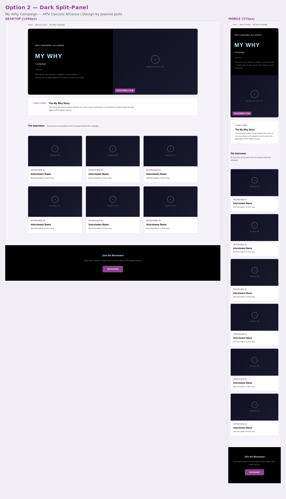
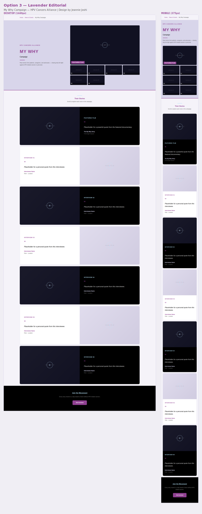
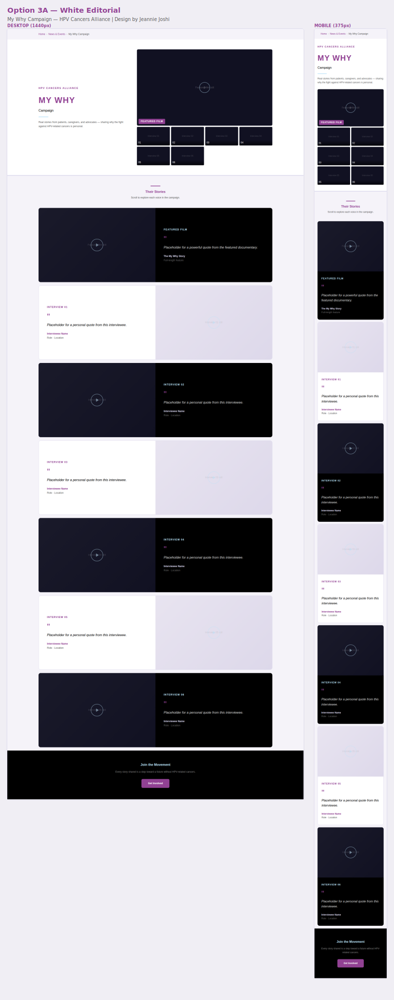
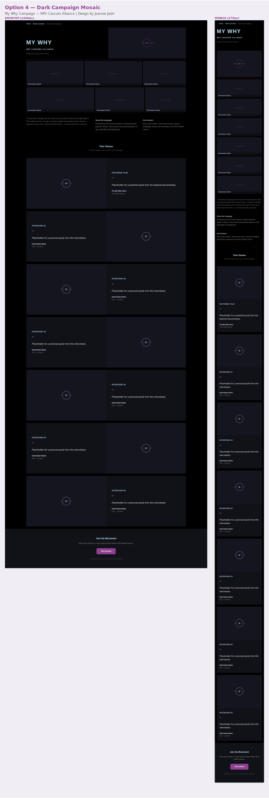
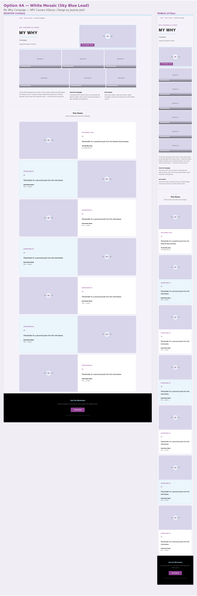
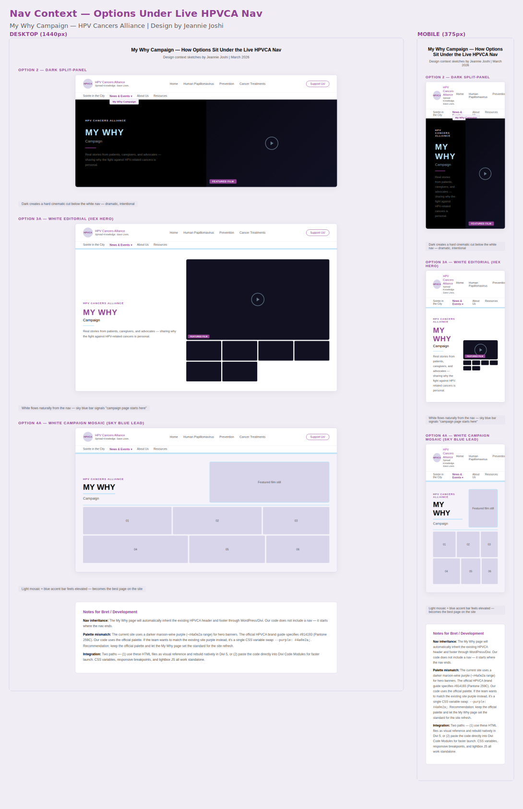

# My Why Campaign — Design Options for Review

**HPV Cancers Alliance** | Design by Jeannie Joshi | March 2026

Each option below shows desktop (1440px) and mobile (375px) side by side. All designs use the official HPVCA brand palette, Trebuchet MS typography, and are fully responsive.

Pick one direction — I'll deliver final production code for that option.

---

## Option 2 — Dark Split-Panel
Cinematic. Featured film hero right, 3×2 grid below. YouTube 16:9 drops right in. Fastest to build.

---

## Option 3 — Lavender Editorial
All 7 videos visible above the fold. Scroll down for full editorial panels with stills and pull-quotes. Lavender hero.

---

## Option 3A — White Editorial
Same as 3, white hero. Brighter, cleaner.

---

## Option 4 — Dark Campaign Mosaic
The BMS LIVING-inspired direction. Asymmetric mosaic grid, editorial scroll below. Most cinematic.

---

## Option 4A — White Campaign Mosaic
Same mosaic layout, white background, sky blue leading. Blue is HPVCA's gender-inclusive awareness color — intentional choice here.

---

## Nav Context — How Options Sit Under the Live HPVCA Site
Includes developer notes on palette mismatch and integration paths.

---

### Next Steps
1. Pick one direction
2. Final production code delivered for selected option
3. Bret handles WordPress/Divi integration and fine-tuning
4. Team finalizes all placeholder copy (names, quotes, descriptions)
